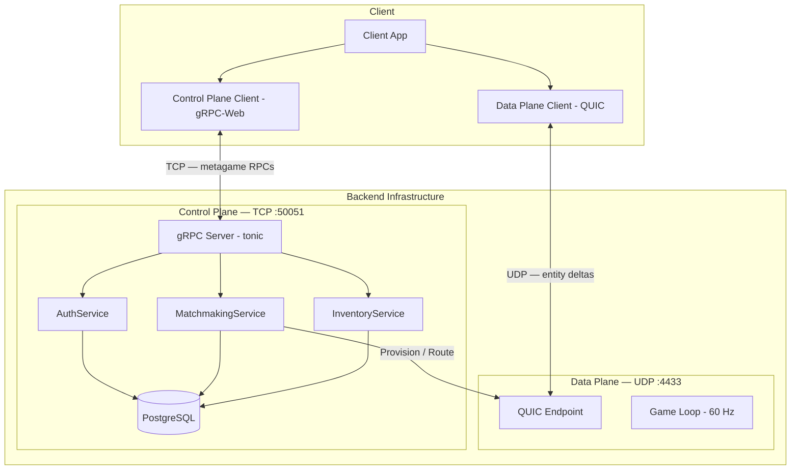
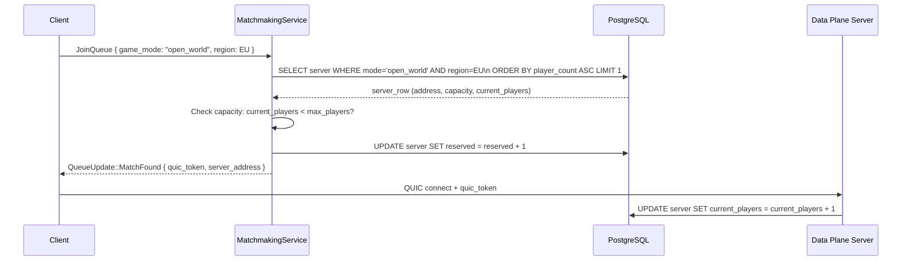
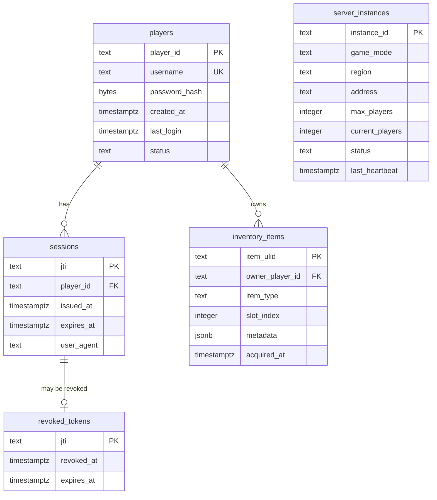

# Aetheris Engine — Control Plane Architecture & Design Document

## Table of Contents

1. [Executive Summary](#executive-summary)
2. [Control Plane vs. Data Plane](#2-control-plane-vs-data-plane)
3. [Protobuf Service Definitions](#3-protobuf-service-definitions)
4. [Auth Service — Session Management](#4-auth-service--session-management)
5. [Matchmaking Service — World Routing](#5-matchmaking-service--world-routing)
6. [Inventory & Economy Service](#6-inventory--economy-service)
7. [Server Discovery & Health Checking](#7-server-discovery--health-checking)
8. [gRPC-Web for Browser Clients](#8-grpc-web-for-browser-clients)
9. [Database Model — Control Plane State](#9-database-model--control-plane-state)
10. [Error Handling & Idempotency](#10-error-handling--idempotency)
11. [Crate Structure & Module Layout](#11-crate-structure--module-layout)
12. [Performance Contracts](#12-performance-contracts)
13. [Open Questions](#13-open-questions)
14. [Appendix A — Glossary](#appendix-a--glossary)
15. [Appendix B — Decision Log](#appendix-b--decision-log)

---

## Executive Summary

The Control Plane manages all transactional and metagame services that do **not** require real-time UDP synchronization. Authentication, matchmaking, inventory persistence, and session lifecycle are handled here, through **gRPC over HTTP/2**, using **Protocol Buffer schemas** for strong API contracts and cross-language interoperability.

The Control Plane is physically and logically separate from the Data Plane:

- It runs on a different listening port (TCP 50051 vs. UDP 4433).
- It tolerates **200 ms latency** (UI interaction) vs. the Data Plane's **<16 ms** requirement.
- It uses TCP for its strong ordering guarantees — inventory mutations must not arrive out of order.
- It scales independently — a single Control Plane server can serve hundreds of Data Plane game world instances.

See [TRANSPORT_DESIGN.md §2](TRANSPORT_DESIGN.md#2-dual-plane-topology) for details on the physical isolation and dual-plane topology.

### Service Inventory

| Service | Status | Phase | Purpose |
|---|---|---|---|
| `AuthService` | Implemented | P1 | Login, logout, QUIC token issuance |
| `MatchmakingService` | Implemented | P1 | Assign players to world instances |
| `InventoryService` | Stub | P2 | Item management, equipment, storage |
| `EconomyService` | Specified | P1 | Market transactions, currency (promoted by M1050) |
| `LeaderboardService` | Stub | P2 | Rankings, score aggregation |
| `GuildService` | Stub | P3 | Player associations and group state |

---

## 2. Control Plane vs. Data Plane



**Interaction flow:**

1. Client calls `AuthService.Login()` → receives `{ jwt, quic_token }`.
2. Client calls `MatchmakingService.JoinQueue()` → server streams back `{ server_address, quic_token }` when a slot is found.
3. Client opens QUIC connection to `server_address` using the `quic_token`.
4. Data Plane verifies the token (HMAC) and admits the player to the game loop.
5. Ongoing: Client calls `InventoryService.*` for item management between sessions.

The Control Plane and Data Plane are **intentionally decoupled at the session level**. A Data Plane server does not need to call the Control Plane during the 60 Hz game loop. The token validation is a one-time handshake at connection time.

See [SECURITY_DESIGN.md §7](SECURITY_DESIGN.md#7-identity--authentication) for the canonical authentication flow and identity model.

---

## 3. Protobuf Service Definitions

All Control Plane APIs are defined in `.proto` files under `crates/aetheris-protocol/proto/`. Proto3 syntax is used throughout. `tonic-build` generates Rust server/client stubs at compile time via `build.rs`.

### 3.1 Common Types

> **Status (Planned):** `proto/common.proto` does not yet exist. The `PlayerId`,
> `QuicConnectToken`, and `ErrorDetail` message types below are design specifications
> for P2/P3. Currently, the only proto file is `proto/auth.proto`.

```protobuf
// proto/common.proto  (Planned — P2)
syntax = "proto3";
package aetheris.common;

// A globally unique player identity, assigned at account creation.
// Immutable for the lifetime of the account.
message PlayerId {
    string ulid = 1;  // ULID format: 26-char URL-safe base32, monotonically sortable
}

// A short-lived session token for QUIC Data Plane admission.
// 30-second TTL, HMAC-signed with the server's transport secret.
message QuicConnectToken {
    bytes token = 1;
    int64 expires_at_unix_ms = 2;
    string server_address = 3;  // "host:port" for the assigned Data Plane server
}

// Standard error details, attached to all Status responses.
message ErrorDetail {
    string field  = 1;   // Which request field caused the error (if applicable)
    string reason = 2;   // Human-readable reason code
}
```

### 3.2 `AuthService`

> **Current state (P1):** The real `proto/auth.proto` defines a single `Authenticate` RPC.
> `Logout`, `RefreshToken`, and `IssueConnectToken` are **Planned — not yet in proto**.
> The `LoginRequest` below corresponds to the current `AuthRequest`; the response currently
> returns a `session_token` (string), not a JWT + QuicConnectToken pair.

```protobuf
// proto/auth.proto  (P1 — implemented)
syntax = "proto3";
package aetheris.auth;

service AuthService {
    // Authenticate and receive a session token.
    rpc Authenticate(AuthRequest) returns (AuthResponse);

    // --- Planned (P2) --- not yet in proto ---
    // rpc Logout(LogoutRequest) returns (LogoutResponse);
    // rpc RefreshToken(RefreshRequest) returns (RefreshResponse);
    // rpc IssueConnectToken(ConnectTokenRequest) returns (ConnectTokenResponse);
}

message AuthRequest {
    string username      = 1;
    string password_hash = 2;  // SHA-256 hex of plaintext password (Phase 1 only)
}

message AuthResponse {
    string session_token  = 1;  // ULID, used in QUIC Data Plane handshake
    uint64 expires_at     = 2;  // Unix timestamp (0 = never in Phase 1)
}
```

### 3.3 `MatchmakingService`

```protobuf
// proto/matchmaking.proto
syntax = "proto3";
package aetheris.matchmaking;

service MatchmakingService {
    // Join the matchmaking queue for a specific game mode.
    // Server-streams back status updates until a match is found or cancelled.
    rpc JoinQueue(QueueRequest) returns (stream QueueUpdate);

    // Cancel a pending queue request.
    rpc CancelQueue(CancelQueueRequest) returns (CancelQueueResponse);

    // Poll active server instances (for direct-join flows).
    rpc ListServers(ListServersRequest) returns (ListServersResponse);
}

message QueueRequest {
    string jwt       = 1;
    string game_mode = 2;  // "pvp_1v1", "pve_coop_4", "open_world", etc.
    int32 region     = 3;  // Preferred region (latency hint)
}

message QueueUpdate {
    oneof status {
        QueuedStatus queued      = 1;  // Position in queue, estimated wait
        MatchFoundStatus matched = 2;  // Server address + QUIC token
        CancelledStatus cancelled= 3;  // Queue cancelled (by client or server)
        ErrorStatus error        = 4;  // Matchmaking error
    }
}

message MatchFoundStatus {
    QuicConnectToken quic_token = 1;  // Ready to open Data Plane connection
    string server_address       = 2;  // "host:4433"
    string world_instance_id    = 3;  // For reconnect attempts
}
```

---

## 4. Auth Service — Session Management

### 4.1 Password Security

Passwords are **never stored plaintext**. The client hashes the password before transmission using **Argon2id** (OWASP recommended for new systems as of 2024):

- Memory: 64 MB
- Iterations: 3
- Parallelism: 4

The server re-derives the hash with its own salt and compares using a constant-time comparison (`subtle::ConstantTimeEq`). If the server is ever compromised, Argon2id hashes are computationally expensive to crack.

### 4.2 JWT Structure

```json
{
  "alg": "HS256",
  "typ": "JWT",
  "exp": 1744732800,     // Unix timestamp: 1 hour from issue
  "iat": 1744729200,
  "sub": "01HZ1RJKG...", // PlayerId ULID
  "jti": "unique-token-id",  // For revocation
  "roles": ["player"]
}
```

The JWT is signed with a secret stored in the server's environment (`JWT_SECRET`). In production, this is a Kubernetes Secret injected as an environment variable. The secret is rotated:

- Automatically every 30 days.
- Immediately on any suspected compromise.

### 4.3 QUIC Connect Token

The QUIC connect token is **separate from the JWT**. It is a short-lived HMAC-SHA256 token:

```rust
pub fn issue_connect_token(
    player_id: &PlayerId,
    server_address: &str,
    transport_secret: &[u8; 32],
) -> QuicConnectToken {
    let expires_at = Utc::now() + Duration::seconds(30);
    let payload = format!("{}:{}:{}", player_id.ulid, server_address, expires_at.timestamp());

    let mut mac = HmacSha256::new_from_slice(transport_secret)
        .expect("HMAC accepts any key size");
    mac.update(payload.as_bytes());
    let token = mac.finalize().into_bytes();

    QuicConnectToken {
        token: token.to_vec(),
        expires_at_unix_ms: expires_at.timestamp_millis(),
        server_address: server_address.to_string(),
    }
}
```

The Data Plane verifies: `HMAC(payload) == token && expires_at > now()`. No database call during QUIC handshake admission.

### 4.4 Token Revocation

JWT revocation uses a **deny-list** in PostgreSQL: the `revoked_tokens` table stores the `jti` of revoked tokens until their natural expiry. On each JWT validation, the `jti` is checked against the deny-list:

```sql
CREATE TABLE revoked_tokens (
    jti        TEXT PRIMARY KEY,
    revoked_at TIMESTAMPTZ NOT NULL DEFAULT NOW(),
    expires_at TIMESTAMPTZ NOT NULL  -- Row auto-deleted after expiry
);
CREATE INDEX ON revoked_tokens (expires_at);
```

A background job purges expired rows hourly.

---

## 5. Matchmaking Service — World Routing

### 5.1 Simple Matchmaking (P1)

Phase 1 matchmaking is deliberately simple: **join the least-loaded running server instance** for the requested game mode. No skill-based matchmaking, no region balancing beyond a simple preference hint.



### 5.2 Server Instance Registry

```sql
CREATE TABLE server_instances (
    instance_id     TEXT PRIMARY KEY,
    game_mode       TEXT NOT NULL,
    region          TEXT NOT NULL,
    address         TEXT NOT NULL,           -- "host:4433"
    max_players     INTEGER NOT NULL,
    current_players INTEGER NOT NULL DEFAULT 0,
    reserved        INTEGER NOT NULL DEFAULT 0,
    status          TEXT NOT NULL DEFAULT 'running',  -- running | draining | dead
    last_heartbeat  TIMESTAMPTZ NOT NULL DEFAULT NOW()
);
CREATE INDEX ON server_instances (game_mode, region, current_players);
```

Data Plane servers heartbeat the registry every 5 seconds. If a server misses 3 heartbeats (15 s), it is marked `dead` and removed from matchmaking.

### 5.3 Reconnect Flow

On disconnect, the client stores the `world_instance_id` received at `MatchFoundStatus`. For 60 seconds after disconnect, the client attempts to reconnect to the same instance directly (bypassing the matchmaking queue) by re-issuing a `ConnectToken` and re-opening the QUIC connection.

After 60 seconds, the world instance is assumed to have cleaned up the player's entity and the client is routed through normal matchmaking to a fresh slot.

---

## 6. Inventory & Economy Service

> **Status:** Specified (P2). Schema and service contract defined here; implementation at M350.

### 6.1 Inventory Service Schema

```protobuf
service InventoryService {
    // Returns the player's full inventory.
    rpc GetInventory(GetInventoryRequest) returns (GetInventoryResponse);

    // Moves an item between slots (drag-and-drop, equip, unequip).
    rpc MoveItem(MoveItemRequest) returns (MoveItemResponse);

    // Transfers an item to another player or to a bank NPC.
    rpc TransferItem(TransferItemRequest) returns (TransferItemResponse);
}
```

All mutations are **optimistic** on the client — the UI updates immediately. If the server rejects the mutation (e.g., target slot full), the client rolls back. This matches the reconciliation pattern used for movement prediction.

### 6.2 Idempotency Keys

All mutating RPCs carry an `idempotency_key` field. If the client retries a timed-out request, the server returns the same result without re-executing:

```protobuf
message MoveItemRequest {
    string jwt             = 1;
    string idempotency_key = 2;  // ULID generated by client, once per operation
    string item_ulid       = 3;
    int32 destination_slot = 4;
}
```

The server stores `idempotency_key → result` for 24 hours in PostgreSQL. Duplicate keys return the cached result without modifying state.

---

## 7. Server Discovery & Health Checking

### 7.1 Health Check Protocol

The gRPC standard health check service is implemented (`grpc.health.v1.Health`). This enables Kubernetes liveness and readiness probes without custom HTTP endpoints.

```yaml
# Kubernetes liveness probe
livenessProbe:
  grpc:
    port: 50051
    service: ""  # Empty string = overall health
  initialDelaySeconds: 10
  periodSeconds: 5
```

### 7.2 Graceful Drain

When a Control Plane pod receives `SIGTERM`:

1. Sets status to `DRAINING` — no new requests are accepted into `JoinQueue`.
2. Completes all in-flight RPCs (max 30-second drain window).
3. Calls `SIGTERM`-safe Control+C handler: notifies all `JoinQueue` streams with `CancelledStatus`.
4. Exits cleanly.

The Data Plane servers heartbeating the registry continue unaffected; they reconnect to a healthy Control Plane instance via Kubernetes Service load balancing.

---

## 8. gRPC-Web for Browser Clients

Standard gRPC requires HTTP/2 trailers for stream termination, but browsers cannot access these in a standard `fetch()` call. **gRPC-Web** adapts the protocol to work over `fetch()` by:

1. Framing the protobuf payload with a 5-byte prefix (flag + message length).
2. Encoding trailers in the body after the last message (not as HTTP trailers).

`tonic` serves both native gRPC and gRPC-Web on the same port with the `tonic-web` middleware:

```rust
// In server startup
let auth_svc = AuthServiceServer::new(AuthServiceImpl::new(db.clone()));
let svc = tonic_web::enable(auth_svc);

Server::builder()
    .accept_http1(true)   // Required for gRPC-Web (HTTP/1.1 base)
    .add_service(svc)
    .serve(addr)
    .await?;
```

The browser client uses `tonic-web-wasm-client` which automatically selects gRPC-Web mode:

```typescript
// The same .proto-generated client works in both browser and native contexts.
// tonic-web-wasm-client wraps calls in gRPC-Web framing transparently.
const client = new AuthServiceClient("https://api.server.com:50051");
```

---

## 9. Database Model — Control Plane State

All Control Plane state lives in **PostgreSQL** (managed by `sqlx` with compile-time query validation).

### 9.1 Table Overview



### 9.2 Connection Pooling

```rust
// Initialized at server startup. Shared across all gRPC service handlers.
let pool = sqlx::PgPool::connect_with(
    PgConnectOptions::new()
        .host(&config.db_host)
        .port(config.db_port)
        .database(&config.db_name)
        .username(&config.db_user)
        .password(&config.db_password)
        .ssl_mode(PgSslMode::Require),  // TLS in production
).await?;

// Pool parameters
PgPoolOptions::new()
    .max_connections(20)  // Per Control Plane pod
    .min_connections(5)
    .acquire_timeout(Duration::from_secs(5))
```

---

## 10. Error Handling & Idempotency

### 10.1 gRPC Status Codes

All service errors map to standard gRPC status codes:

| Error Condition | gRPC Code | Notes |
|---|---|---|
| Invalid credentials | `UNAUTHENTICATED` | Never reveal which field was wrong |
| Expired JWT | `UNAUTHENTICATED` | Client must call `RefreshToken` |
| Insufficient permissions | `PERMISSION_DENIED` | Player not allowed to access this resource |
| Server over capacity | `RESOURCE_EXHAUSTED` | Retry with backoff |
| Item not found | `NOT_FOUND` | |
| Idempotency key conflict (different payload) | `ALREADY_EXISTS` | Client bug: key reuse |
| Database error | `INTERNAL` | Generic error, do not expose details |
| Request payload too large | `INVALID_ARGUMENT` | Item transfer > allowed batch size |

### 10.2 Client Retry Policy

gRPC clients should apply exponential backoff with jitter for `UNAVAILABLE` and `RESOURCE_EXHAUSTED`:

```
attempt 1:  immediate
attempt 2:  200ms + rand(0..100ms)
attempt 3:  400ms + rand(0..200ms)
attempt 4:  800ms + rand(0..400ms)
attempt 5:  1600ms + rand(0..800ms)
give up after 5 attempts or 10 seconds total
```

`UNAUTHENTICATED` and `INVALID_ARGUMENT` are **not retried** — they require user action (login again, fix the request).

---

## 11. Crate Structure & Module Layout

```
crates/aetheris-protocol/
├── build.rs               # tonic-build: generates Rust stubs from .proto files
├── Cargo.toml
├── proto/
│   ├── auth.proto         # AuthService definition
│   ├── matchmaking.proto  # MatchmakingService definition
│   ├── inventory.proto    # InventoryService (P2)
│   ├── economy.proto      # EconomyService (P2)
│   └── common.proto       # Shared message types (PlayerId, QuicConnectToken, etc.)
└── src/
    ├── lib.rs             # Re-exports: WorldState trait, NetworkId, Encoder trait, etc.
    └── types.rs           # Core protocol primitives

crates/aetheris-server/
└── src/
    ├── auth.rs            # impl AuthServiceServer: login, logout, token issuance
    ├── multi_transport.rs # Glue: Data Plane + Control Plane server startup
    └── config.rs          # ServerConfig: ports, DB URL, secrets from env
```

---

## 12. Performance Contracts

| Metric | Target | How Measured |
|---|---|---|
| `Login` RPC latency (p99) | ≤ 200 ms | Prometheus histogram |
| `JoinQueue` time to match (p99) | ≤ 5 s | Prometheus histogram |
| `IssueConnectToken` latency (p99) | ≤ 50 ms | Prometheus histogram |
| DB query latency (p99) | ≤ 20 ms | sqlx tracing span |
| Concurrent RPC capacity (per pod) | ≥ 1,000 | Load test with `ghz` |
| JWT validation (in-memory, p99) | ≤ 1 ms | Criterion bench |

### 12.1 Telemetry Counters

| Metric | Type | Description |
|---|---|---|
| `aetheris_cp_login_requests_total` | Counter | Total login attempts |
| `aetheris_cp_login_failures_total` | Counter | Failed logins (password mismatch, etc.) |
| `aetheris_cp_active_sessions` | Gauge | Currently valid JWTs |
| `aetheris_cp_matchmaking_queue_depth` | Gauge | Players waiting for a server slot |
| `aetheris_cp_matchmaking_match_time` | Histogram | Time from JoinQueue to MatchFound |
| `aetheris_cp_token_revocations_total` | Counter | Tokens explicitly invalidated |

---

## 13. Open Questions

| Question | Context | Impact |
|---|---|---|
| **Global Load Balancing** | How to route players to the geographically closest Data Plane instance during matchmaking? | Latency and player experience. |
| **Transaction Privacy** | Should economy transactions be obfuscated via Zero-Knowledge proofs in P3? | Security and privacy vs complexity. |
| **Redis for Matchmaking** | Should we move the matchmaking queue from PostgreSQL to Redis for sub-millisecond updates? | Scalability under extreme traffic. |

---

## Appendix A — Glossary

### Mini-Glossary (Quick Reference)

- **Control Plane**: The architectural layer managing metadata, auth, and stateful transactions.
- **gRPC-Web**: A translation layer enabling browser `fetch()` calls to interact with gRPC services.
- **ULID (Universally Unique Lexicographically Sortable Identifier)**: A sortable substitute for UUIDs.
- **Idempotency Key**: A unique string ensuring an operation is only executed once even if retried.
- **Matchmaking Registry**: A centralized database table tracking all active game world instances.

[Full Glossary Document](../GLOSSARY.md)

---

## Appendix B — Decision Log

| # | Decision | Rationale | Revisit If... | Date |
|---|---|---|---|---|
| D1 | gRPC over REST | Strongly typed contracts, streaming support, and efficient serialization. | Frontend ecosystem requirements force REST. | 2026-04-15 |
| D2 | Protocol Buffers | 3–10× smaller than JSON and provides direct codegen for Rust. | Schema evolution becomes too rigid for rapid changes. | 2026-04-15 |
| D3 | Argon2id for passwords | Modern, memory-hard KDF resistant to GPU brute-force attacks. | A newer, faster, more secure KDF standard emerges. | 2026-04-15 |
| D4 | JWT + separate QUIC token | Limits the blast radius of token theft by separating transport and API auth. | Separation adds too much complexity for minimal gain. | 2026-04-15 |
| D5 | ULID for identifiers | Lexicographical sorting is better for DB performance than UUID v4. | DB engine optimization makes UUID v4 equally fast. | 2026-04-15 |
