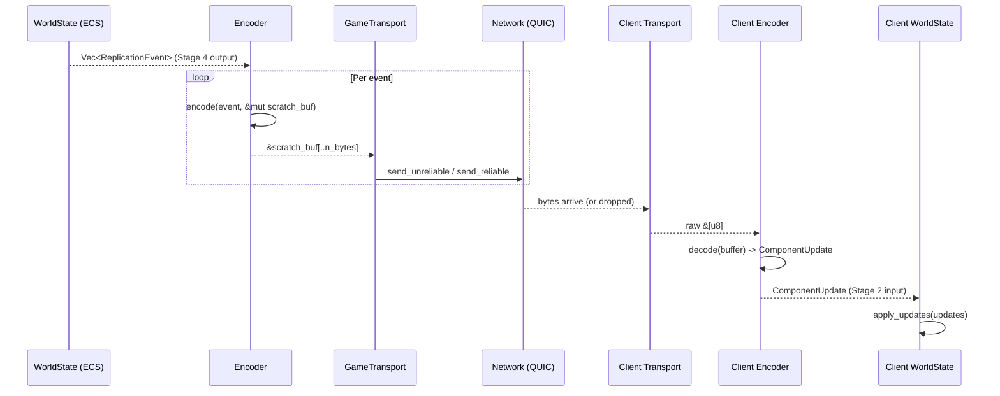

# Aetheris Engine — Encoder & Serialization Architecture

## Table of Contents

1. [Executive Summary](#executive-summary)
2. [The `Encoder` Trait](#2-the-encoder-trait)
3. [Phase 1 — `SerdeEncoder` (MVP)](#3-phase-1--serdeencoder-mvp)
4. [Phase 3 — `BitpackEncoder` (Artisanal)](#4-phase-3--bitpackencoder-artisanal)
5. [Wire Format Specification](#5-wire-format-specification)
6. [Delta Compression Strategy](#6-delta-compression-strategy)
7. [Quantization — Floating-Point Compression](#7-quantization--floating-point-compression)
8. [Allocation-Free Design](#8-allocation-free-design)
9. [Security: Malformed Payload Handling](#9-security-malformed-payload-handling)
10. [Crate Structure & Module Layout](#10-crate-structure--module-layout)
11. [Performance Contracts](#11-performance-contracts)
12. [Open Questions](#12-open-questions)
13. [Appendix A — Glossary](#appendix-a--glossary)
14. [Appendix B — Decision Log](#appendix-b--decision-log)

---

## Executive Summary

The Encoder is the translation layer between the engine's internal `ReplicationEvent`s and the wire bytes that flow over the network. Its sole job is to produce the most compact, fastest-to-generate binary representation of ECS component changes.

The design follows the **"Measure Before You Optimize"** principle and evolves in two stages:

| Phase | Crate | Format | Primary Goal |
|---|---|---|---|
| **P1 — MVP** | `aetheris-encoder-serde` | MessagePack (rmp-serde) | Correctness and iteration speed. Schema-full. |
| **P3 — Artisanal** | `aetheris-encoder-bitpack` | Custom bit-packed binary | Maximum bandwidth efficiency. Zero-allocation. |

Both phases implement the same `Encoder` trait from `aetheris-protocol`. The game loop, the transport layer, and the ECS adapter are **completely unaware** of which encoder is active. Switching from P1 to P3 is a startup configuration decision, not a code change.

### Design Principles

- **allocation-free on the hot path.** The `encode` method writes into a caller-supplied buffer. No `Vec`, no `String`, no `Box` during steady-state operation.
- **Graceful on malformed input.** Decoders must never panic on crafted adversarial bytes. Every decode path has explicit bounds checking.
- **Schema evolution.** New component fields must be addable without breaking older clients still running the P1 format. The `ComponentKind` discriminant provides an extension point.

---

## 2. The `Encoder` Trait

The `Encoder` trait defines the serialization contract for all network payloads.

See [PROTOCOL_DESIGN.md §3](PROTOCOL_DESIGN.md#3-encoder--serialization-protocol) for the canonical trait definition of `Encoder`.

### 2.1 How the Encoder Fits into the Pipeline

### 2.1 How the Encoder Fits into the Pipeline



---

## 3. Phase 1 — `SerdeEncoder` (MVP)

### 3.1 Format: MessagePack

MessagePack is a compact binary format that maps directly onto serde's data model. Unlike JSON, it encodes integers and booleans without field-name strings — `42` encodes as `0x2a` (1 byte) rather than `"health"` (8 bytes) in JSON.

**Why MessagePack for P1?**

- `rmp-serde` provides drop-in serde compatibility. Any `#[derive(Serialize, Deserialize)]` type is instantly encodable.
- Excellent tooling: `rmpv` for inspection, msgpack.org decoders in any language for debugging.
- Schema-full format means the encoder is correct without custom field-level logic.
- Overhead is acceptable for P1 (<500 entities); exact savings measured before attempting P3.

### 3.2 Wire Layout (P1)

```
┌──────────────┬─────────────────┬──────────┬──────────────────────────┐
│ NetworkId    │ ComponentKind   │ Tick     │ Payload (msgpack bytes)  │
│ u64 (8 B)   │ u16 (2 B)       │ u64 (8 B)│ variable                 │
└──────────────┴─────────────────┴──────────┴──────────────────────────┘
                                              │
                                              ▼ example: Position component
                                        { x: f32, y: f32, z: f32 }
                                        msgpack: [0x93, 0xca, ..., 0xca, ..., 0xca, ...]
                                        = 3 floats × ~5 bytes each = ~15 bytes payload
```

**Full P1 frame overhead for one Position update:**

- **Fixed Header**: 8 (NetworkId) + 2 (Kind) + 8 (Tick) = 18 bytes.
- **MessagePack Overhead**: `rmp-serde` adds ~1-3 bytes of tag metadata (e.g., Array/Map marker) for the payload.
- **Payload**: ~12 bytes (3× f32 raw bytes).
- **Total**: ~31-33 bytes per entity position update.

At 2,500 entities: ~82 KB per tick. At 60 Hz: ~39 Mbps. This is within P1 budget.

### 3.3 `SerdeEncoder` Internals

```rust
pub struct SerdeEncoder;

impl Encoder for SerdeEncoder {
    fn encode(&self, event: &ReplicationEvent, buf: &mut [u8]) -> Result<usize, EncodeError> {
        // Write the fixed header first
        if buf.len() < HEADER_SIZE {
            return Err(EncodeError::BufferOverflow {
                needed: HEADER_SIZE,
                available: buf.len(),
            });
        }
        buf[0..8].copy_from_slice(&event.network_id.0.to_le_bytes());
        buf[8..10].copy_from_slice(&event.component_kind.0.to_le_bytes());
        buf[10..18].copy_from_slice(&event.tick.to_le_bytes());

        // Write the msgpack payload directly into the remaining buffer
        let mut cursor = std::io::Cursor::new(&mut buf[18..]);
        rmp_serde::encode::write(&mut cursor, &event.payload)
            .map_err(|_| EncodeError::SerializationFailed)?;

        Ok(18 + cursor.position() as usize)
    }

    fn decode(&self, buf: &[u8]) -> Result<ComponentUpdate, EncodeError> {
        if buf.len() < HEADER_SIZE {
            return Err(EncodeError::MalformedPayload { offset: 0 });
        }
        let network_id = NetworkId(u64::from_le_bytes(buf[0..8].try_into().unwrap()));
        let component_kind = ComponentKind(u16::from_le_bytes(buf[8..10].try_into().unwrap()));
        let tick = u64::from_le_bytes(buf[10..18].try_into().unwrap());
        let payload = buf[18..].to_vec();

        Ok(ComponentUpdate { network_id, component_kind, tick, payload })
    }

    fn max_encoded_size(&self) -> usize {
        18 + 1200 // header + conservative msgpack max
    }
}
```

### 3.4 Known P1 Limitations

| Limitation | Impact | P3 Resolution |
|---|---|---|
| Full component snapshot per change | `Position` sends all 3 floats even if only `x` changed | Field-level dirty mask in P3 |
| msgpack type-tag overhead | Every f32 costs 1 extra byte (msgpack Float32 tag) | Bit-packed raw binary, no tags |
| `to_vec()` for payload | Heap allocation per decode | Borrowed slice, zero-copy decode |
| f32 full precision on all fields | 32 bits for position that varies by 0.1 units | Quantization to 16–23 bits |
| No compression of correlated data | Adjacent entities with identical movement waste bytes | Inter-entity delta streaming (P4) |

---

## 4. Phase 3 — `BitpackEncoder` (Artisanal)

> **Status:** Specified. Implementation begins at milestone M650.
> **Gate:** P2 bandwidth measurements must show P1 encoder is the bottleneck.

### 4.1 Core Concept: Bit-Level Packing

The `BitpackEncoder` writes values at their **true semantic bit width**, not their storage type width:

| Value | P1 Width | P3 Width | Savings |
|---|---|---|---|
| Position x/y/z (quantized ±1024m, 0.01m precision) | 32 bits (f32) | 18 bits (quantized i16-equiv) | 44% |
| Health (0–1000) | 32 bits (u32) | 10 bits | 69% |
| Rotation (quaternion w, normalized ±1) | 32 bits (f32) × 4 | 9 bits × 3 (smallest-3 method) | 72% |
| ComponentKind (0–255) | 16 bits (u16) | 8 bits | 50% |
| NetworkId (sparse, <65536 live entities) | 64 bits (u64) | 20 bits (at 2^20 = 1M entity max) | 69% |
| `is_alive` boolean | 8 bits (u8) | 1 bit | 87% |

Values are packed sequentially across 32-bit word boundaries in little-endian order and flushed at the end of the frame.

### 4.2 `BitWriter` / `BitReader` Primitives

```rust
/// A cursor-based writer that packs values at arbitrary bit widths.
/// Writes into a caller-provided &mut [u8] buffer. Zero allocation.
pub struct BitWriter<'a> {
    buf: &'a mut [u8],
    /// Current byte position in buf.
    byte_pos: usize,
    /// Bit offset within current byte (0–7).
    bit_pos: u8,
}

impl<'a> BitWriter<'a> {
    /// Writes `bits` LSBs of `value` into the buffer.
    /// Panics in debug mode if bits > 64 or value overflows bits.
    #[inline(always)]
    pub fn write_bits(&mut self, value: u64, bits: u8) -> Result<(), EncodeError> {
        debug_assert!(bits <= 64);
        debug_assert!(bits == 64 || value < (1u64 << bits));

        let mut remaining = bits;
        let mut v = value;
        while remaining > 0 {
            let available = 8 - self.bit_pos;
            let to_write = remaining.min(available);
            let mask = ((1u64 << to_write) - 1) as u8;

            if self.byte_pos >= self.buf.len() {
                return Err(EncodeError::BufferOverflow {
                    needed: self.byte_pos + 1,
                    available: self.buf.len(),
                });
            }

            self.buf[self.byte_pos] |= ((v as u8) & mask) << self.bit_pos;
            v >>= to_write;
            self.bit_pos += to_write;
            remaining -= to_write;

            if self.bit_pos == 8 {
                self.bit_pos = 0;
                self.byte_pos += 1;
            }
        }
        Ok(())
    }

    /// Returns the number of bytes written (rounded up to whole bytes).
    pub fn bytes_written(&self) -> usize {
        if self.bit_pos > 0 { self.byte_pos + 1 } else { self.byte_pos }
    }
}
```

### 4.3 P3 Wire Layout per `ReplicationEvent`

```
Bits  0–19:  NetworkId          (20 bits — supports up to 1M concurrent entities)
Bits 20–27:  ComponentKind      (8 bits  — 256 component types)
Bits 28–30:  ReliabilityTier    (2 bits  — Volatile / Critical / Ordered)
Bit  31:     DirtyMask present? (1 bit   — 0 = full snapshot, 1 = field mask follows)
// If DirtyMask = 1:
  Bits 32–?: DirtyMask          (variable, per-component schema)
// Payload:
  Variable:  Only dirty fields, at quantized bit widths
```

**Example: Position component with only `x` changed, 18-bit quantized:**

```
[NetworkId: 20b][Kind: 8b][Tier: 2b][DirtyMask: 1b][FieldMask: 3b = 0b001][x: 18b]
= 20 + 8 + 2 + 1 + 3 + 18 = 52 bits = 7 bytes
vs P1: 18 bytes header + 15 bytes payload = 33 bytes
→ 79% size reduction for a single-field position update
```

**Example: Full entity snapshot at spawn (all fields):**

```
[NetworkId: 20b][Kind: 8b][Tier: 2b][DirtyMask: 0b][Position: 54b][Health: 10b]
[Velocity: 54b][Rotation: 27b(smallest-3)]
= 175 bits = 22 bytes
vs P1: 18 + ~40 bytes = 58 bytes
→ 62% size reduction for a full spawn packet
```

---

## 5. Wire Format Specification

### 5.1 Endianness

All multi-byte integers are **little-endian**. WASM is inherently little-endian on all current targets. x86-64 servers are little-endian natively. Big-endian targets are not supported.

### 5.2 P1 Header (18 bytes, fixed)

```
Offset  Size  Field
0       8     network_id: u64 LE
8       2     component_kind: u16 LE
10      8     tick: u64 LE
18      var   msgpack payload
```

### 5.3 P3 Bit-Packed Frame (variable, starts at bit 0)

```
[0..19]  NetworkId (u20 LE)
[20..27] ComponentKind (u8)
[28..29] ReliabilityTier (u2: 0=Volatile, 1=Critical, 2=Ordered)
[30]     SnapshotMode (1=full, 0=delta with dirty mask)
[31..?]  Payload (bit-packed per component schema)
```

Component schemas are registered at startup. Each schema declares:

- Field names and their semantic ranges: `position_x: f32 range [-1024.0, 1024.0] precision 0.01`
- Bit width: computed from range and precision: `ceil(log2(2048 / 0.01)) = 18 bits`
- Default value: used for absent fields in delta frames.

---

## 6. Delta Compression Strategy

### 6.1 Phase 1 — Full Snapshots

Every modified component sends its entire state each tick:

```
Entity 9942: Position changed (x moved, y/z same)
→ encode: {x: 10.5, y: 0.0, z: 5.3}     ← all 3 fields, even unchanged ones
→ 33 bytes
```

This is wasteful but simple. The P1 `WorldState` change detection (Bevy ticks) already ensures only *changed components* are emitted — just not *changed fields* within a component.

### 6.2 Phase 3 — Field-Level Deltas

Each component type carries a `DirtyMask` — a bitmask indicating which fields changed since the last snapshot. Only dirty fields are packed into the payload:

```
Entity 9942: Position changed (only x moved this tick)
DirtyMask: 0b001  (bit 0 = x)
→ encode: [mask: 3 bits][x: 18 bits] = 21 bits ≈ 3 bytes
→ vs P1: 33 bytes → 91% reduction for single-field updates
```

**Invariant:** If a client missed the previous tick's snapshot (dropped unreliable packet), the next *full snapshot* (sent every N ticks or on request) resets their state. Clients must not accumulate deltas indefinitely without anchoring to a full snapshot.

### 6.3 Full Snapshot Forcing

Full snapshots are sent:

- On entity spawn (always).
- Every 60 ticks (~1 second) for all entities as a re-sync heartbeat.
- On demand when the client sends a `RequestFullSnapshot` control message.

---

### 7. Quantization — Fixed-Point Binary Compression

Floating-point values are overkill for game state. Aetheris uses **fixed-point quantization** to compress f32 values into small bit-width integers. A position accurate to 0.01 meters does not need 32 bits of IEEE 754 precision — it needs `ceil(log2(total_range / precision))` bits.

### 7.1 Quantization Formula

```rust
/// Quantizes a floating-point value into an unsigned integer of `bits` width.
///
/// Example: position_x = 10.573, range [-1024.0, 1024.0], bits = 18
///   total_range = 2048.0
///   steps = 2^18 = 262,144
///   step_size = 2048.0 / 262144 = 0.0078125 (≈ 0.8 cm precision)
///   quantized = round((10.573 - (-1024.0)) / 0.0078125) = 133,845
pub fn quantize(value: f32, min: f32, max: f32, bits: u8) -> u32 {
    let range = max - min;
    let steps = (1u32 << bits) - 1;
    let normalized = (value.clamp(min, max) - min) / range;
    (normalized * steps as f32).round() as u32
}

/// Dequantizes back to f32. Max error = step_size / 2.
pub fn dequantize(quantized: u32, min: f32, max: f32, bits: u8) -> f32 {
    let range = max - min;
    let steps = (1u32 << bits) - 1;
    min + (quantized as f32 / steps as f32) * range
}
```

### 7.2 Component Quantization Table

| Component Field | Range | Bits | Precision | P1 Size | P3 Size |
|---|---|---|---|---|---|
| `Position.x/y/z` | ±1024 m | 18 | 0.78 cm | 4 B | 2.25 B |
| `Velocity.dx/dy/dz` | ±100 m/s | 14 | 0.012 m/s | 4 B | 1.75 B |
| `Rotation` (quaternion) | ±1.0 | 9×3 (smallest-3) | 0.004 rad | 16 B | 3.4 B |
| `Health` | 0–1000 | 10 | 1 HP | 4 B | 1.25 B |
| `Stamina` | 0–100 | 7 | 1 point | 4 B | 0.9 B |
| `SuspicionScore` | 0–255 | 8 | 1 | 1 B | 1 B |

### 7.3 Rotation: Smallest-Three Quaternion Encoding

A unit quaternion has 4 components (w, x, y, z) constrained to `w² + x² + y² + z² = 1`. We can reconstruct the largest component from the other three:

1. Identify the largest absolute component (2 bits to encode *which* one).
2. Store the 3 smallest, normalized to `[-1/√2, 1/√2]`, at 9 bits each.
3. Reconstruct the 4th component on decode: `√(1 - a² - b² - c²)`.

Total: 2 + 9×3 = 29 bits ≈ 3.6 bytes vs 16 bytes (4×f32). **78% compression.**

---

## 8. Allocation-Free Design

The allocation contract is non-negotiable for the encoder:

```
Stage 5 (send, budget 2.0 ms):
  for each ReplicationEvent:
    encoder.encode(event, &mut scratch_buf)  ← writes into pre-allocated scratch
    transport.send_unreliable(client_id, &scratch_buf[..n])  ← borrows slice
```

The `scratch_buf` is a `[u8; 1200]` stack-allocated byte array per send call. The encoder writes into it and returns the byte count. The transport borrows a slice. No extra allocation occurs.

**Decoder side (Stage 2, budget 2.0 ms):**

```rust
// Client-side decode path: zero heap allocation
fn decode_in_place(buf: &[u8], out: &mut ComponentUpdate) -> Result<(), EncodeError> {
    // Reads directly from the borrowed slice.
    // out is a pre-allocated ComponentUpdate stack slot.
    // No Vec, no String, no Box.
}
```

---

## 9. Security: Malformed Payload Handling

The decoder is a **trust boundary component**. Every path must handle adversarial input without panicking, allocating unboundedly, or leaking information:

### 9.1 Decoder Invariants

```
D1 — Bounds check first: Never access buf[offset] before checking buf.len() > offset.
D2 — No panic on crafted input: All index operations use checked arithmetic.
D3 — No unbounded allocation: payload field max size = FRAGMENT_THRESHOLD (1140 bytes).
D4 — Reject unknown ComponentKind: Log + discard; do not attempt to decode.
D5 — Reject out-of-range quantized values: Clamp on decode, log as WARN.
D6 — No information leakage in errors: EncodeError does not include server-internal state.
```

### 9.2 Fuzz Testing Target

```rust
#[cfg(fuzzing)]
pub fn fuzz_decode(data: &[u8]) {
    let encoder = SerdeEncoder;
    // Must never panic. EncodeError is the only valid non-Ok outcome.
    let _ = encoder.decode(data);
}
```

The fuzz target is registered with `cargo-fuzz` and runs in CI against a corpus of 10,000+ generated payloads. Any panic is a P0 bug.

---

## 10. Crate Structure & Module Layout

```
crates/
├── aetheris-encoder-serde/          # Phase 1 — MessagePack
│   ├── Cargo.toml                   # depends on: aetheris-protocol, rmp-serde, serde
│   └── src/
│       ├── lib.rs                   # pub use SerdeEncoder
│       ├── encoder.rs               # impl Encoder for SerdeEncoder
│       └── header.rs                # HEADER_SIZE constant + header r/w helpers
│
└── aetheris-encoder-bitpack/        # Phase 3 — Artisanal bit-packing
    ├── Cargo.toml                   # depends on: aetheris-protocol, bytemuck
    └── src/
        ├── lib.rs                   # pub use BitpackEncoder
        ├── encoder.rs               # impl Encoder for BitpackEncoder
        ├── bitwriter.rs             # BitWriter<'a> — zero-alloc bit cursor
        ├── bitreader.rs             # BitReader<'a> — zero-alloc bit cursor
        ├── quantize.rs              # quantize() / dequantize() utilities
        ├── schema.rs                # ComponentSchema registry: field ranges + bit widths
        └── rotation.rs              # Smallest-three quaternion encode/decode
```

---

## 11. Performance Contracts

| Operation | P1 Target | P3 Target | How Measured |
|---|---|---|---|
| `encode()` per event | ≤ 0.4 µs | ≤ 0.05 µs | Criterion bench |
| `decode()` per event | ≤ 0.5 µs | ≤ 0.06 µs | Criterion bench |
| Encode 2,500 events/tick | ≤ 1.0 ms | ≤ 0.2 ms | Criterion bench |
| Encode heap allocations | 1 `Vec` per decode | 0 | `cargo-instruments` alloc profiler |
| Compressed size per entity/tick | ~33 bytes | ~7–12 bytes | `aetheris-benches` |
| Fuzz test coverage | 100% decode paths | 100% decode paths | `cargo-fuzz` |

### 11.1 Telemetry Counters

| Metric | Type | Description |
|---|---|---|
| `aetheris_encoder_events_encoded_total` | Counter | Total encode() calls |
| `aetheris_encoder_events_decoded_total` | Counter | Total decode() calls |
| `aetheris_encoder_encode_errors_total` | Counter | BufferOverflow + SerializationFailed |
| `aetheris_encoder_decode_errors_total` | Counter | MalformedPayload + UnknownComponent |
| `aetheris_encoder_bytes_encoded_total` | Counter | Total bytes written by encode() |
| `aetheris_encoder_bytes_decoded_total` | Counter | Total bytes consumed by decode() |

---

## 12. Open Questions

| Question | Context | Impact |
|---|---|---|
| **Inter-Entity Compression** | Can we compress entities with identical field values into a single "batch" reference? | Further bandwidth reduction for dense groups. |
| **Dictionary Encoding** | Should we use a dynamic dictionary for frequently repeated payloads? | Efficiency for strings and complex enum variants. |
| **SIMD Bit-packing** | Is there a performance benefit to using SIMD for bit-level shifts in P3? | Reduced CPU cost on the encode hot-path. |

---

## Appendix A — Glossary

[GLOSSARY.md](https://github.com/garnize/aetheris/blob/main/docs/GLOSSARY.md)

---

## Appendix A — Glossary

### Mini-Glossary (Quick Reference)

- **Quantization**: Compressing floating-point values into fixed-point integers at a specific bit-width.
- **Bit-packing**: Encoding data at arbitrary bit boundaries rather than byte boundaries.
- **Smallest-Three**: A rotation compression technique that stores only the 3 smallest components of a unit quaternion.
- **MessagePack**: A schema-full binary format used in Aetheris Phase 1.
- **Dirty Mask**: A bitmask indicating which fields in a component were mutated.

[Full Glossary Document](https://github.com/garnize/aetheris/blob/main/docs/GLOSSARY.md)

---

## Appendix B — Decision Log

| # | Decision | Rationale | Revisit If... | Date |
|---|---|---|---|---|
| D1 | MessagePack for P1 | Drop-in serde compatibility. No custom schemas to maintain. Compact binary. | Encode/decode cost exceeds 10% of budget. | 2026-04-15 |
| D2 | Custom bit-packing for P3 | Bandwidth efficiency at massive concurrency. No existing library is schema-aware. | P1 bandwidth proves sufficient under load. | 2026-04-15 |
| D3 | Field-level dirty masks | Reduces redundant data transmission by ~85% in typical gameplay. | Complexity outweighs performance gain. | 2026-04-15 |
| D4 | `encode` into caller buffer | Zero-allocation on the hot path. MTU-safe pre-allocation. | Buffer management becomes too complex for developers. | 2026-04-15 |
| D5 | Fuzz testing the decoder | Decoder is a trust boundary. High risk of RCE/DoS from crafted packets. | Decoder logic is replaced by a formal-verified DSL. | 2026-04-15 |
