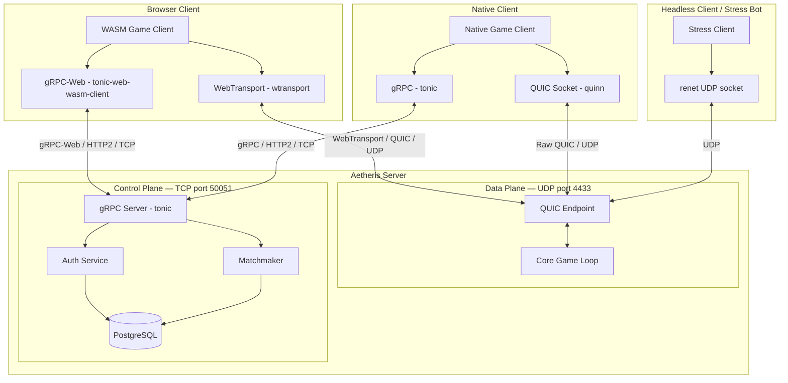
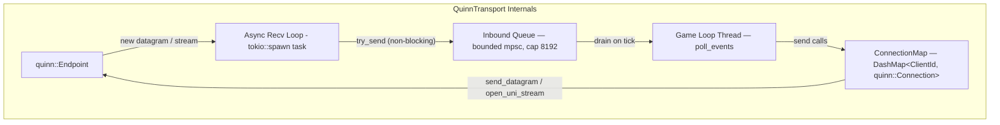
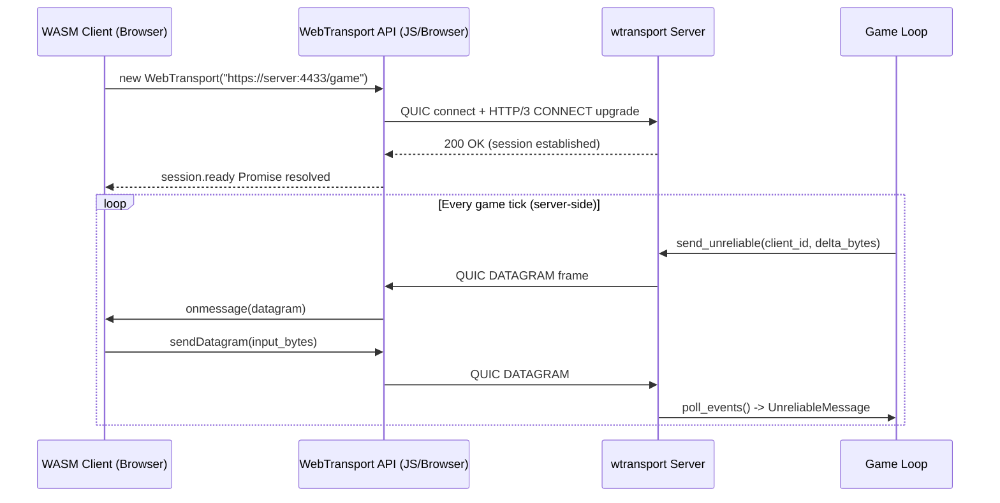
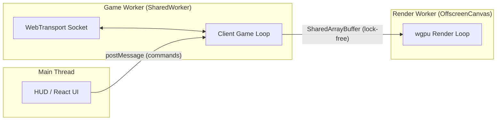
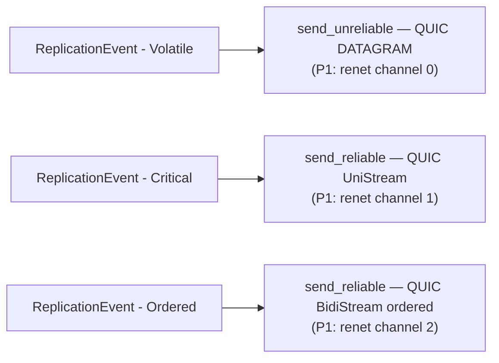
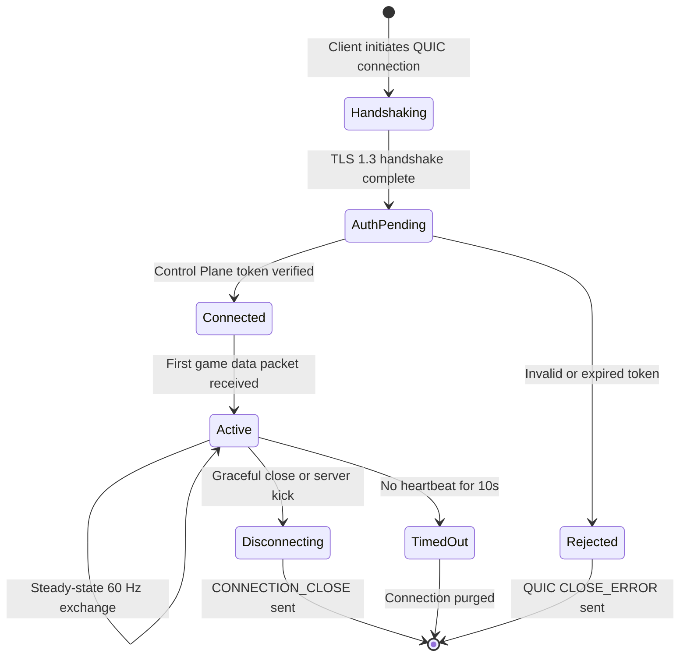

# Aetheris Engine — Transport Architecture & Design Document

## Table of Contents

1. [Executive Summary](#executive-summary)
2. [Dual-Plane Topology](#2-dual-plane-topology)
3. [The `GameTransport` Trait](#3-the-gametransport-trait)
4. [Phase 1 — `RenetTransport` (MVP)](#4-phase-1--renettransport-mvp)
5. [Phase 3 — `QuinnTransport` (Artisanal QUIC)](#5-phase-3--quinntransport-artisanal-quic)
6. [WebTransport — Browser Data Plane](#6-webtransport--browser-data-plane)
7. [Reliability Tier System](#7-reliability-tier-system)
8. [Connection Lifecycle](#8-connection-lifecycle)
9. [MTU & Fragmentation Strategy](#9-mtu--fragmentation-strategy)
10. [Congestion Control & Backpressure](#10-congestion-control--backpressure)
11. [TLS & Authentication Handshake](#11-tls--authentication-handshake)
12. [Crate Structure & Module Layout](#12-crate-structure--module-layout)
13. [Performance Contracts](#11-performance-contracts)
14. [Open Questions](#14-open-questions)
15. [Appendix A — Glossary](#appendix-a--glossary)
16. [Appendix B — Decision Log](#appendix-b--decision-log)

---

## Executive Summary

The Aetheris Transport layer handles the physical movement of bytes between the authoritative server and heterogeneous clients. It is the first and last subsystem to interact with the operating system's network stack — everything above and below it speaks in protocol-neutral types.

The design is built on three core principles:

1. **Dual-Plane Isolation.** Real-time game state (Data Plane) and transactional metagame RPCs (Control Plane) are physically separate channels. Mixing them creates head-of-line blocking, priority inversion, and makes congestion attribution impossible.

2. **Selective Reliability.** Position updates are fire-and-forget; death events are guaranteed. QUIC's multiplexed streams give us both on a single UDP port without TCP's global HOL blocking. The reliability tier is determined by the `ComponentKind` of each replication event — not by blanket policy.

3. **Trait-First Layering.** The game loop holds a `Box<dyn GameTransport>` and calls four methods. The loop has never heard of `renet` or `quinn`. This facade enables the P1 → P3 transport swap without touching a single line of game logic.

### Phase Summary

| Phase | Data Plane Library | Why |
|---|---|---|
| **P1 — MVP** | `renet 2.0` | Abstracts reliability channels over UDP. Minimal setup, battle-tested API. |
| **P3 — Artisanal** | `quinn 0.11` | Direct QUIC: per-stream flow control, zero-copy datagrams, full observability. |
| **Browser** | `wtransport 0.7` | WebTransport over QUIC for browser WASM clients. Same trait, browser-safe. |

---

## 2. Dual-Plane Topology

Aetheris strictly partitions all network traffic into two planes. They are different protocols on different ports with different backend infrastructure.



### 2.1 Data Plane Properties

| Property | Value |
|---|---|
| **Protocol** | QUIC (native) / WebTransport (browser) |
| **Transport** | UDP |
| **Server Port** | 4433 |
| **Crate (P1)** | `renet 2.0` + `renet_netcode` |
| **Crate (P3)** | `quinn 0.11` (native) + `wtransport 0.7` (browser) |
| **Encryption** | TLS 1.3 (mandatory in QUIC) |
| **Usage** | Entity position deltas, input commands, physics sync |

The Data Plane carries the 60 Hz stream of entity state changes that define the live game world. Every byte here sits on the critical path of Stage 5 (2.0 ms tick budget).

**Why QUIC over raw UDP?**
Raw UDP is unencrypted and provides zero delivery guarantees. Implementing reliability, ordering, and encryption on top of it is a multi-year project full of subtle bugs (DTLS handshake intricacies, flow-control logic, replay-attack protection). QUIC provides all of this plus multiplexed streams that eliminate head-of-line blocking. A dropped position datagram is acceptable — the next tick overwrites it. A dropped "player died" event is catastrophic. QUIC's per-stream reliability lets us treat each case correctly without a second round-trip.

### 2.2 Control Plane Properties

| Property | Value |
|---|---|
| **Protocol** | gRPC over HTTP/2 |
| **Transport** | TCP |
| **Server Port** | 50051 |
| **Crate** | `tonic 0.12` |
| **Schema** | Protocol Buffers v3 |
| **Usage** | Auth, matchmaking, inventory, session tokens |

The Control Plane carries transactional metagame requests. Latency here is measured in 10–100 ms — acceptable for UI interactions. Strong API contracts (`.proto` schemas), cross-language codegen, and schema evolution are the design priorities.

**Why gRPC for the Control Plane?**
Protobuf schemas provide compile-time field contracts. Adding a new field is a safe, backward-compatible operation. This matters for a metagame API that evolves independently of the game binary. gRPC also provides deadline propagation, cancellation, and server-streaming — all of which we use in matchmaking.

---

## 3. The `GameTransport` Trait

The `GameTransport` trait is the **firewall** between the game loop and any specific transport library.

See [PROTOCOL_DESIGN.md §2](PROTOCOL_DESIGN.md#2-gametransport--network-abstraction) for the canonical trait definition of `GameTransport`.

### 3.1 `NetworkEvent` Type

```rust
/// Events produced by `GameTransport::poll_events()`.
#[derive(Debug)]
pub enum NetworkEvent {
    /// Client completed the QUIC handshake and is gameloop-ready.
    ClientConnected(ClientId),

    /// Client disconnected (graceful, timeout, or server-initiated).
    ClientDisconnected {
        client_id: ClientId,
        reason: DisconnectReason,
    },

    /// Raw unreliable datagram from a client (position, input).
    UnreliableMessage {
        client_id: ClientId,
        data: Vec<u8>,
    },

    /// Raw reliable message from a client (spell cast, chat).
    /// Ordering is guaranteed within a single stream.
    ReliableMessage {
        client_id: ClientId,
        data: Vec<u8>,
    },
}

#[derive(Debug, Clone, Copy)]
pub enum DisconnectReason {
    GracefulClose,
    Timeout,
    ServerInitiated { reason_code: u8 },
    ProtocolError,
}
```

---

## 4. Phase 1 — `RenetTransport` (MVP)

### 4.1 Rationale

`renet 2.0` is a high-level networking crate optimized for games. It manages UDP sockets, reliability channels, connection authentication via `renet_netcode`, and heartbeating. The API maps cleanly onto `GameTransport` with minimal glue.

**Reasons for P1 selection:**

- Three reliability channels (unreliable / reliable-unordered / reliable-ordered) map directly to Aetheris's reliability tier model.
- `netcode` protocol handles connection tokens, replay-attack prevention, and client auth before any game data flows.
- Single-threaded synchronous architecture matches the Phase 1 game loop.

### 4.2 Channel Layout

```
renet Channel 0 — Unreliable    → Volatile tier (Position, Velocity, Rotation)
renet Channel 1 — Reliable      → Critical tier (Health, Death, SpellCast)
renet Channel 2 — ReliableOrdered → Ordered tier (Chat, Inventory, QuestUpdate)
```

### 4.3 `RenetTransport` Internals

The `RenetTransport` wraps `RenetServer` and implements `GameTransport`. It also integrates a
**token-bucket `RateLimiter` per source IP** to defend against UDP amplification and per-client
message flooding.

> [!SECURITY]
> **Rate Limiting**: The rate limiter is checked in `poll_events` before messages are enqueued. Packets exceeding the configured burst are silently dropped and counted via a `tracing` counter to mitigate DoS attacks.

```rust
pub struct RenetTransport {
    server: RenetServer,
}

impl GameTransport for RenetTransport {
    fn poll_events(&mut self) -> Vec<NetworkEvent> {
        self.server.update(Duration::from_millis(0));

        let mut events = Vec::new();

        for id in self.server.clients_id_just_connected() {
            events.push(NetworkEvent::ClientConnected(ClientId(id)));
        }
        for id in self.server.clients_id_just_disconnected() {
            events.push(NetworkEvent::ClientDisconnected {
                client_id: ClientId(id),
                reason: DisconnectReason::GracefulClose,
            });
        }
        for id in self.server.clients_id() {
            while let Some(msg) = self.server.receive_message(id, Channel::Unreliable as u8) {
                events.push(NetworkEvent::UnreliableMessage {
                    client_id: ClientId(id),
                    data: msg.into(),
                });
            }
            while let Some(msg) = self.server.receive_message(id, Channel::Reliable as u8) {
                events.push(NetworkEvent::ReliableMessage {
                    client_id: ClientId(id),
                    data: msg.into(),
                });
            }
        }
        events
    }
    // ...
}
```

### 4.4 Known P1 Limitations

| Limitation | Impact | P3 Resolution |
|---|---|---|
| Synchronous socket polling | Cannot exploit `io_uring` async I/O | `quinn` uses Tokio async I/O natively |
| Per-message `Vec<u8>` allocation | Small heap alloc per inbound packet | Zero-copy `BytesMut` ring buffer in `quinn` |
| Separate `netcode` auth from gRPC auth | Two auth systems in P1 | Unified token: gRPC issues QUIC connect token |
| No per-stream flow control visibility | Cannot observe stream-level backpressure | `quinn::SendStream` exposes per-stream queues |
| 1 KB unreliable payload cap | Large components must split manually | Configurable QUIC datagram limits |

---

## 5. Phase 3 — `QuinnTransport` (Artisanal QUIC)

> **Status:** Specified. Implementation begins at milestone M600.
> **Gate:** P2 stress tests must confirm P1 transport is the measured bottleneck.

### 5.1 Architecture Overview



The socket receive loop runs in a dedicated Tokio task and deposits decoded `NetworkEvent`s into a bounded `mpsc` channel. The game loop drains this channel synchronously in Stage 1. This separates I/O latency from tick latency: a slow UDP receive batch does not delay tick start.

### 5.2 Zero-Copy Receive

`quinn` exposes `Connection::read_datagram` accepting a pre-allocated `BytesMut`. The transport maintains a **ring buffer** of pre-allocated segments:

```rust
/// Pre-allocated recv ring: 1000 clients × 64 datagrams × 1200 bytes ≈ 73 MB
const RECV_RING_CAPACITY: usize = 1000 * 64 * 1200;
```

Incoming datagrams write directly into the ring without heap allocation. The `NetworkEvent` carries a `RecvHandle` — a view into the ring valid until the next `poll_events()` call.

### 5.3 Per-`ComponentKind` QUIC Streams

In P3, a separate QUIC unidirectional stream is opened per `ComponentKind` requiring reliable delivery. This eliminates HOL blocking within the reliable tier:

```
QUIC Connection (ClientId 9942):
  DATAGRAM:          volatile position / velocity events
  UniStream #4:      HealthUpdate (ComponentKind 4)
  UniStream #7:      DeathEvent   (ComponentKind 7)
  UniStream #11:     ChatMessage  (ComponentKind 11)
  UniStream #13:     InventoryMutation (ComponentKind 13)
```

A dropped `HealthUpdate` stream packet no longer stalls `ChatMessage` delivery.

---

## 6. WebTransport — Browser Data Plane

> [!WARNING]
> **Implementation status (P1-partial):** The `aetheris-transport-webtransport` crate is currently in progress. The `GameTransport` trait implementation is incomplete; specifically, `poll_events()` does not yet fully handle all event variants, and `connected_client_count()` is missing.

### 6.1 Why WebTransport

Browsers cannot open raw UDP sockets. WebSocket runs over TCP — no datagrams, no selective reliability. The only browser API that exposes QUIC semantics is **WebTransport** (W3C spec, supported in Chrome, Firefox, and Safari since 2024).

WebTransport allows:

- **Unreliable datagrams:** `sendDatagram()` — fire-and-forget game state.
- **Reliable unidirectional streams:** per-`ComponentKind` critical events.
- **Bidirectional streams:** client input commands to server.

The server-side `wtransport 0.7` crate wraps `quinn` with an HTTP/3 upgrade handshake (required by spec). After upgrade, the connection behaves identically to raw QUIC.

### 6.2 WebTransport Handshake Sequence



### 6.3 WASM Client Worker Topology

In `aetheris-client-wasm`, the transport runs entirely inside the **Game Worker**. The main thread never touches the QUIC socket:



---

## 7. Reliability Tier System

Every replicated component belongs to exactly one reliability tier — a compile-time property of its `ComponentKind`:

```rust
#[derive(Debug, Clone, Copy, PartialEq, Eq)]
pub enum ReliabilityTier {
    /// Fire-and-forget datagrams. Expected and acceptable loss.
    /// Stale data overwritten by the next tick.
    Volatile,

    /// Guaranteed delivery. No ordering guarantee across different component types.
    /// Loss causes permanent client desync.
    Critical,

    /// Guaranteed delivery AND sequential ordering within this component type.
    Ordered,
}
```

### 7.1 Tier Assignment Table

| Component | Tier | Rationale |
|---|---|---|
| `Position` | Volatile | Next tick overwrites. Loss = 1 frame visual glitch. |
| `Velocity` | Volatile | Client extrapolates from last known. Loss = minor prediction error. |
| `Rotation` | Volatile | Interpolated by render layer. Loss invisible at normal framerates. |
| `AnimationState` | Volatile | Visual only. Out-of-date animation acceptable. |
| `Health` | Critical | Loss = wrong HP bar permanently shown. |
| `Death` | Critical | Loss = entity never dies on client. Hard desync. |
| `Respawn` | Critical | Entity must reappear on client. |
| `SpellCast` | Critical | Visual effect + gameplay consequence. Loss is visible. |
| `ChatMessage` | Ordered | Must appear in send order. |
| `InventoryMutation` | Ordered | Out-of-order application corrupts item count. |
| `BankTransaction` | Ordered | Economic integrity requires strict ordering. |

### 7.2 Tier → Wire Channel Mapping



---

## 8. Connection Lifecycle



### 8.1 Authentication Token Flow

The QUIC connection token is issued by the Control Plane after a successful login:

```mermaid
sequenceDiagram
    participant Client
    participant Auth as Auth Service (gRPC :50051)
    participant Transport as Data Plane (:4433)
    participant Loop as Game Loop

    Client->>Auth: Login(username, password_hash)
    Auth-->>Client: SessionToken { jwt, quic_token, ttl_30s }
    Note over Auth,Client: quic_token = HMAC(server_secret, client_id + expiry)
    Client->>Transport: QUIC CONNECT + quic_token
    Transport->>Transport: Verify HMAC — reject if expired or invalid
    Transport-->>Client: QUIC handshake accepted
    Transport->>Loop: NetworkEvent::ClientConnected(ClientId)
    Loop->>Client: send_reliable(SpawnSelf { network_id, position })
```

The `quic_token` is separate from the JWT. It is short-lived (30s TTL) and HMAC-signed with a secret shared between the Auth Service and Transport layer. A valid JWT alone cannot open a QUIC connection; only the freshly-minted transport token can.

### 8.2 Heartbeat & Timeout

- Heartbeat interval: every **2 seconds** when no game data flows.
- Connection timeout: **10 seconds** of silence before cleanup.
- Benefit: lost-signal mobile clients have up to 10s to reconnect without full re-login.

---

## 9. MTU & Fragmentation Strategy

### 9.1 Target MTU

The safe QUIC datagram size for global Internet paths is **1200 bytes** (accounting for IPv6 header, QUIC overhead, and common tunnel encapsulation). LAN paths can use **1400 bytes**.

```rust
/// Maximum safe payload for unreliable datagrams on the global Internet.
pub const VOLATILE_MTU: usize = 1200 - 60; // = 1140 bytes (60 bytes QUIC overhead)

/// If a single encoded event exceeds this, it must be fragmented or promoted.
pub const FRAGMENT_THRESHOLD: usize = VOLATILE_MTU;
```

### 9.2 Tick-Level Batch Packing

At the end of Stage 5, all `ReplicationEvent`s for one tick are packed into as few datagrams as possible:

```
Tick 5024: 2,500 ReplicationEvents
  Sort:  [37 Critical] [12 Ordered] [2,451 Volatile]
  Pack:  Critical → 37 individual reliable streams
  Pack:  Ordered  → 12 ordered streams
  Pack:  Volatile → bin-pack into 1,140-byte datagrams ≈ 18 datagrams
  Send:  18 unreliable + 49 reliable calls to GameTransport
```

---

## 10. Congestion Control & Backpressure

### 10.1 QUIC Congestion Control

`quinn` uses **CUBIC** by default (same as Linux TCP). For Phase 3 we plan to evaluate **BBR** (Bottleneck Bandwidth and RTT), which performs better on high-BDP WAN paths.

When the QUIC send buffer fills, `send_unreliable()` returns `Err(TransportError::CongestionDrop)`. The game loop:

1. Logs `WARN congestion_drop client_id=... tick=...`.
2. Increments `aetheris_transport_congestion_drops_total`.
3. Continues — the next tick sends fresher data.

Critical events are never dropped silently. If a reliable stream's 4 MB send buffer fills (client accumulating but not consuming), the server calls `disconnect(client_id, REASON_BACKPRESSURE)`.

### 10.2 Per-Client Send Budget

To prevent a single slow client from saturating outbound bandwidth:

```rust
/// Max bytes sent per client per tick (~60 Hz × 50 KB = 3 MB/s cap).
const CLIENT_TICK_BUDGET_BYTES: usize = 50 * 1024;
```

Events exceeding the budget queue for the next tick. Priority: Critical > Ordered > Volatile.

In Phase 3, the per-client budget is further refined by the **Priority Channel** system. Each channel in the `ChannelRegistry` declares a `budget_pct` (percentage of the per-client budget). The `PriorityScheduler` allocates bytes to channels in priority order (P0 first), ensuring that high-priority data is never starved by lower-priority traffic — even when the total budget is sufficient. See [PRIORITY_CHANNELS_DESIGN.md §10](https://github.com/garnizeh-labs/aetheris-engine/blob/main/docs/PRIORITY_CHANNELS_DESIGN.md#10-bandwidth-budgeting) for the per-channel allocation model.

---

## 11. TLS & Authentication Handshake

### 11.1 Development

```bash
# Self-signed cert generated at server startup if absent:
# target/dev-certs/cert.pem   (365-day, localhost + 127.0.0.1)
# target/dev-certs/key.pem
cargo run -p aetheris-server --features phase1
# INFO generated self-signed cert at target/dev-certs/cert.pem
```

Stress-test clients pass `--dev` to disable cert verification. Browser WASM clients require the cert to be trusted via browser flags or a local CA.

### 11.2 Production (ACME / Let's Encrypt)

In production, `rcgen` generates a CSR submitted to Let's Encrypt via ACME. `rustls` handles TLS 1.3 negotiation. The certificate is stored in a Kubernetes Secret and auto-rotated on renewal.

### 11.3 1-RTT QUIC Handshake

QUIC embeds the TLS 1.3 handshake in **QUIC CRYPTO frames**. Connection establishment completes in **1 RTT**. 0-RTT resumption is available but disabled by default due to replay-attack risk on game sessions where repeated auth tokens are dangerous.

---

## 12. Crate Structure & Module Layout

```
crates/
├── aetheris-transport-renet/          # Phase 1 — MVP
│   ├── Cargo.toml
│   └── src/
│       ├── lib.rs                     # pub use RenetTransport
│       ├── adapter.rs                 # impl GameTransport for RenetTransport
│       └── config.rs                  # RenetConfig: port, max_clients
│
├── aetheris-transport-quinn/          # Phase 3 — native QUIC
│   ├── Cargo.toml
│   └── src/
│       ├── lib.rs
│       ├── adapter.rs                 # impl GameTransport for QuinnTransport
│       ├── connection.rs              # Per-connection state + stream registry
│       ├── recv_loop.rs               # Async recv task → bounded mpsc channel
│       └── tls.rs                     # Dev self-signed + prod ACME
│
└── aetheris-transport-webtransport/   # Browser WebTransport adapter
    ├── Cargo.toml
    └── src/
        ├── lib.rs
        ├── adapter.rs                 # impl GameTransport for WebTransportAdapter
        └── session.rs                 # wtransport::Session lifecycle
```

---

## 13. Performance Contracts

| Metric | P1 Target | P3 Target | How Measured |
|---|---|---|---|
| `stage_poll_ms` p99 | ≤ 1.0 ms | ≤ 0.5 ms | Prometheus histogram |
| `stage_send_ms` p99 | ≤ 2.0 ms | ≤ 1.0 ms | Prometheus histogram |
| `send_unreliable()` p99 | ≤ 0.10 ms/call | ≤ 0.05 ms/call | Criterion bench |
| `poll_events()` under 1K clients | ≤ 1.0 ms | ≤ 0.3 ms | Criterion bench |
| Connection establishment (server) | ≤ 5 ms | ≤ 2 ms | Integration test |
| Peak outbound bandwidth | 100 Mbps | 400 Mbps | `aetheris-smoke-test` |
| Max concurrent clients | 500 (P1) | 2,500 (P3) | Stress test M400 |

### 13.1 Telemetry Counters

| Metric | Type | Description |
|---|---|---|
| `aetheris_transport_clients_connected` | Gauge | Current client count |
| `aetheris_transport_packets_inbound_total` | Counter | Total inbound packets |
| `aetheris_transport_packets_outbound_total` | Counter | Total outbound packets |
| `aetheris_transport_bytes_inbound_total` | Counter | Total inbound bytes |
| `aetheris_transport_bytes_outbound_total` | Counter | Total outbound bytes |
| `aetheris_transport_congestion_drops_total` | Counter | Volatile datagrams dropped by congestion |
| `aetheris_transport_reliable_queue_depth` | Histogram | Outbound reliable queue depth per client |
| `aetheris_transport_connection_errors_total` | Counter | Connection failures by DisconnectReason |

---

## 14. Open Questions

| Question | Context | Impact |
|---|---|---|
| **UDP Fragmentation** | Should we implement a custom fragmentation layer for datagrams slightly over MTU? | Reliability for bloated volatile updates. |
| **BBR Tuning** | What are the optimal BBR parameters for high-frequency (60Hz) game traffic? | Latency spikes on congested links. |
| **WASM Multi-threading** | If `wtransport` runs in a separate worker, how do we handle SharedArrayBuffer integration? | Latency between transport and ECS. |

---

---

## Appendix A — Glossary


### Mini-Glossary (Quick Reference)

- **QUIC**: A modern UDP-based transport protocol with integrated encryption and multiplexing.
- **WebTransport**: A browser API for low-latency bidirectional communication using QUIC.
- **HOL (Head-of-Line) Blocking**: A TCP issue where one lost packet stalls all subsequent data.
- **Selective Reliability**: The ability to send some data unreliably (datagrams) and some reliably (streams).
- **MTU (Maximum Transmission Unit)**: The maximum size of a single packet (~1200 bytes for UDP).

[Full Glossary Document](https://github.com/garnize/aetheris/blob/main/docs/GLOSSARY.md)

---

## Appendix B — Decision Log

| # | Decision | Rationale | Revisit If... | Date |
|---|---|---|---|---|
| D1 | QUIC over WebSocket | WebSocket lacks datagrams and selective reliability, causing HOL blocking. | A new WebSocket extension for datagrams arrives. | 2026-04-15 |
| D2 | WebTransport for browser | Best browser API for QUIC semantics; better than WebRTC for server-client. | WebTransport is deprecated by a faster API. | 2026-04-15 |
| D3 | Renet for P1, Quinn for P3 | Renet reduces risk in MVP; Quinn offers low-level control for Phase 3. | Quinn proves too complex or Renet is sufficient. | 2026-04-15 |
| D4 | 0-RTT disabled | Risks replay attacks on sensitive game sessions. | Security model is updated to allow 0-RTT safely. | 2026-04-15 |
| D5 | Managed dev-certs | Simplifies onboarding by auto-generating self-signed TLS certs. | Prod security requires mandatory ACME even in dev. | 2026-04-15 |
| D6 | Priority Channel integration for per-client budgeting | Channel-aware budgeting (`budget_pct` per channel) replaces simple Critical > Ordered > Volatile priority in P3. See [PRIORITY_CHANNELS_DESIGN.md](https://github.com/garnizeh-labs/aetheris-engine/blob/main/docs/PRIORITY_CHANNELS_DESIGN.md). | If channel overhead makes simple 3-tier priority sufficient. | 2026-04-15 |
